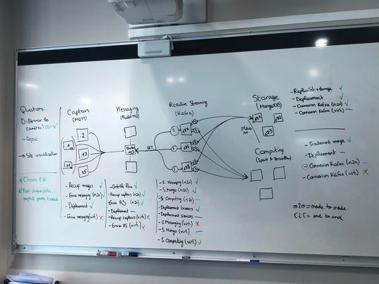
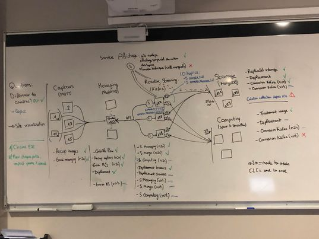
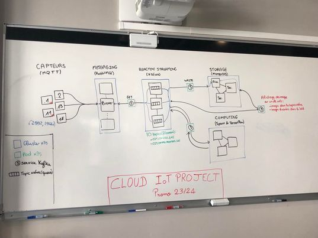

[](https://classroom.github.com/a/NPsCwZiZ)
[](https://classroom.github.com/online_ide?assignment_repo_id=12365787&assignment_repo_type=AssignmentRepo)
# Projet Cloud IoT - INSA Lyon

Dans ce repertoire vous allez enregistrez les démarches que l'équipe de travail a suivi
pour mettre en place une architecture Edge/Fog IoT fonctionnel.

Dans ce fichier `README.md` vous devez décrire en format Markdown chacune des étapes et comptes rendus de chaque avancement, pensez bien à la répartition des tâches dans votre équipe et si besoin créez d'autres repertoires ou utilisez les sous-dossiers proposés.


## Équipe

Notre équipe projet est composée par :

- Vivekananda Boudia (Sensors)
- Zoé Batello (Sensors)

- Chakib Hamie (Messaging)
- Abdeladem Fattah (Messaging)
- Mohamed Bouzoubaa(Messaging)
- Adrianos Sidiras-Galante (Messaging)

- Nabil Azakkour (Reactive Streaming)
- Zihao Wan (Reactive Streaming)
- Khadija Ly(Reactive Streaming)
- Zhenglin Jiang (Reactive Streaming)

- Hiba Bellagnech (Storage)
- Salah Idbelouch (Computing)
- Safae Hariri(Computing)

- Morgan Clot (DevOps)
- Etienne Brunel (DevOps)
- Hugo Thomas (DevOps)
- Abdellah Kabbaj (DevOps)

- Armand Prioreschi (Project manager and Storage)
- Alice Gangneux (Project manager and Sensors)


## Description du Projet

Traitement d'images


### Infrastructure

Le présent projet est deployé dans la plateforme YouPi du Laboratoire CITI en utilisant les noeuds suivants :

```
Rajouter tous les noeuds utilisés
```
Pour se connecter aux noeuds, il faut passer par l'intermediaire du noeud bastion en ssh :

```
youpi.citi-lab.fr
```

Les noeuds sont à réserver sur le site web de la plateforme.


### Cas d'utilisation


## Répartition des tâches
Lors de ce projet les tâches ont été réparties comme suit :

- Equipe Sensors 
- Equipe Messaging 
- Equipe Reactive Streaming
- Equipe Storage
- Equipe Computing
- Equipe Deployment 


### Suivi journalier

**Vendredi 13/10/2023** :
- Introduction du projet Cloud-IoT
- Mise en place des équipes
- Création des comptes Youpi et premières connections aux Raspberry Pi à l'aide des clés SSH
- Création d'un serveur Discord avec des channels pour la communication
- Création d'un board Trello pour chaque équipe pour la gestion de projet

**Lundi 16/10/2023** :
- L'équipe Capteurs a réussi à récupérer des images depuis les 3 caméras fonctionnelles (sur 5). L'équipe a fait le choix du protocole MQTT.
- L'équipe Messaging a installé Californium et RabbitMQ mais opte finalement pour cette dernière solution. La séance a été principalement dédiée à la documentation.
- L'équipe Reactive Streaming a commencé à mettre en place Kafka (au détriment de Vert.X qui ne supporte pas Python) et a commencé à discuter avec les groupes en aval et en amont afin de cerner au mieux ses problématiques et ses enjeux.
- L'équipe Storage Computation s'est documenté sur la manière de mettre en place et tester ses systèmes distribués (base de données et application de traitement d'image), après discussion avec l'équipe Reactive Streaming.
- L'équipe Deployement a commencé à instancier des services avec k3s afin de déployer au mieux les services des autres équipes.
- Une présentation suivi de quelques questions, le tout pour un total de 5 minutes par équipe à été réalisé à la fin de la séance (environ 30 min au total) afin que tout le monde puisse comprendre les enjeux et les difficultés techniques de l'ensemble du projet.

**Mercredi 18/10/2023** :
- L’équipe Capteurs s’est penchée sur la transmission de messages MQTT. En collaboration avec l’équipe Messaging. Ils ont pu mettre en place un broker Rabbit MQ sur un Raspberry et lui envoyer des messages depuis un autre Raspberry (client). L’équipe a réussi à envoyer des messages simples (string), mais également des images avec une faible résolution. Elle a pour objectif maintenant de réfléchir à la manière d’envoyer des images avec une meilleure résolution (discussions sur la compression ou le découpage des images à envoyer).
 - L’équipe Messaging a donc travaillé avec l’équipe Capteurs pour établir la communication et a pour objectif pour la prochaine séance de déployer Rabbit MQ sur plusieurs nœuds.
 - L’équipe Reactive Streaming a réussi à déployer Kafka sur un seul nœud sur lequel leur code Python fonctionne bien. Il faut maintenant réussir à distribuer ces fonctionnalités sur plusieurs nœuds. L’équipe va également devoir utiliser un broker et leur choix s’est porté sur ZooKeeper.
 - L’équipe Storage voulait réussir lors de cette séance à réaliser un réplica set avec MongoDB. Malheureusement, l’équipe a eu des problèmes de configurations et n’a pas réussi à faire fonctionner MongoDB. L’idéal serait d’installer Mongo DB ave Image Docker pour faciliter le travail de l’équipe de déploiement.
 - L’équipe Computing a un code fonctionnel qui détecte bien les personnes, basé sur le module de YOLO qui est pré-entrainé. Leur prochain objectif est de faire la conversion du modèle à TensorFlow.
 - L’équipe Déploiement a set up un cluster Kubernetes avec Ansible. Les prochaines étapes sont de déployer une application dans ce cluster et de monter en compétences sur Ansible.  Ils rappellent aux autres équipes que la communication avec eux est très importante dès maintenant, notamment l’équipe Storage (support Docker).
 - Les chefs de projet ont rappelé que l’objectif était que chaque équipe ait sa partie du projet fonctionnelle à la fin de la prochaine séance qui est dans un mois (13 novembre) et qui laisse donc le temps aux équipes qui ont rencontré des difficultés d’avancer pendant les vacances notamment et/ou d’appeler à l’aide si cet objectif leur parait vraiment difficile à atteindre.  Ceci est dans le but de pouvoir avoir un maximum de temps lors des prochaines séances pour pouvoir faire l’intégration.

**Lundi 13/11/2023**:
La dernière séance était il y a un mois, nous avons donc fait un rappel de l’architecture globale du projet et fait un point sur les avancées de certains groupes lors de ce mois, notamment l’équipe Storage qui a réussi à régler son problème d’installation.
- L’équipe Capteurs a réussi à envoyer des images compressées au broker. La taille des images envoyées est donc passée de 4Mo à 250ko. L’équipe a commencé un script pour automatiser la prise d’image mais elle a besoin de savoir combien d’images doivent être envoyées et tous les combien de temps. Elle a précisé à l’ensemble du groupe les 3 Raspberry utilisés (ceux reliés aux caméras). Elle n’envoie pas d’images à l’équipe messaging mais des images encodées en base 64 (string). Elle a communiqué ses besoins à l’équipe Déploiement. 
- L’équipe Messaging a écrit un script Bash pour l’installation et la mise en cluster. Il faut maintenant les placer sur les Raspberry. Pour l’instant, il n’y a pas de Gateway dans Rabbit MQ. L’équipe regarde les options pour mettre en place du mirroring sur les 3 nœuds. L’équipe est en train d'explorer la possibilité de définir la taille du buffer d'entrée. Actuellement, il n'y a pas de limite pour ce que nous envoyons, mais il est nécessaire de prendre en compte la capacité du réseau afin de ne pas le saturer. Le cluster est configuré mais n’a pas encore été testé. 
- L’équipe Reactive streaming a distribué les brokers (3 noeuds Zookeepers en architecture master/slave). Ils doivent maintenant “kafka-iser” les différents services. Elle a communiqué ses besoins à l’équipe Déploiement. 
- L’équipe Computing a mis en place un cluster avec une architecture master/slave avec 3 Raspberry.  Le but est de distribuer le travail entre plusieurs Raspberry (chaque Raspberry travaille sur un certain nombre d’images). Elle a fait la documentation pour l’équipe Déploiement. Il leur reste à voir comment envoyer leurs résultats à l’équipe Reactive streaming. 
- L’équipe Storage a réussi à résoudre son problème d’installation en passant les OS des Raspberry de 32 à 64 bits. Elle est en tain de mettre en place des réplicas sets mais doit déjà réussir à faire communiquer les Raspberry entre eux. Elle doit donc réussir à faire ça pour la prochaine séance. Elle a travaillé avec l’équipe Déploiement. 
- L’équipe Déploiement a conteneurisé les applications Kafka et Zookeeper. Il leur reste à régler le problème de la gestion des IP si un nœud tombe, avec K3s. Ils mettent également en place plusieurs serveurs pour ne pas avoir de problèmes si le serveur tombe.  Ansible sera utilisé pour les parties capteurs et messaging, car ça ne peut pas être dockerisé car ils ont besoin d’accéder au hardware. 
Chaque partie indépendante doit donc être terminée pour la prochaine séance qui a lieu dans 2 mois (26 janvier) ET doit également communiquer avec les parties précédentes et suivantes (et avec l’équipe déploiement) pour commencer les tests le plus rapidement possible à la prochaine séance. 

**Vendredi 26/01/2024** :
- Capteurs : Envoi des données sur le broker rabbit MQ, en train finir le deploiement (nombre de noeuds)
- Messaging : Interconnection react streaming ok et capteurs ok. Travail sur deploiement, voir si ca sert a clusteriser, travailler avec un seul noeud.
- Reactive Streaming : 2 pi flashés en 64 bits donc reinstall. Recuperation de la premiere image. Recuperation des images en cours, depuis la bdd distribuee
- Storage : Storage des images en b64 + en train de connecter la bdd a un site pour afficher les images
- Computing : En cours de déploiement avec k3s. En train de connecter à Kafka. 
- Deploiement : Deploiement kafka et zooker fonctionnel avec k3s, données repliquées. En train de deployer spark et tensorflow. MongoDB deployé. Rabbit MQ

**Mardi 30/01/2024** :
- Résumé de la séance : 


**Mercredi 31/01/2024** :
- L'équipe capteurs a terminé sa partie. Il reste à voir un détail sur le choix de la QoS. Meilleure est la QoS, plus le temps d'envoi est long et donc cela dépend du temps nécessaire pour le traitement de l'image. Il y a le choix entre 3 niveaux de QoS (0,1 ou 2). Les scripts à jour sont sur Discord.
- Le déploiement est terminé pour l'équipe messaging. 
- Reactive streaming. Le déploiement du cluster Kafka est terminé. Interfaçage entre Messaging et Kafka est fait. Service de stockage sur la BDD mis en place mais pas encore déployé. Service computing en cours mais pas encore mis au point. On attend pour le déploiement des services. Service affichage est fait et le site déployé pour permettre d’afficher les images à la volée. Il reste à faire la connexion avec la BDD.
- L'équipe de stockage est en train de voir si le service fonctionne bien avec l'équipe de reactive streaming. On a une chaîne de bout en bout qui va de l'envoi des images par les capteurs au stockage de ces images dans la base de données. Il reste le déploiement. 
- L'équipe computing doit faire la connexion avec Kafka. 
- L'équipe déploiement a déployée le front et est en train de déployer Spark. 
- Rappel que la soutenance est vendredi à 10h, pas de pression, on se sert du schéma au tableau et chaque équipe présente le travail fait + démonstration. 



**Soutenance 02/02/2024** :
- Rappel de l'objectif du projet : Identifier des personnes dans la salle. 
- Présentation de l'architecture du projet (cf schéma au tableau en photo)
 
- Equipe capteurs : Comme l'objectif est la détection des personnes dans la salle, il a fallu déterminer la résolution souhaitée. Nous souhaitons suffisamment de précision pour reconnaitre des personnes. Nous avons choisi la meilleure résolution possible avec les caméras disponibles puis nous avons compressé l'image (JPEG). Un traitement a été effectué directement à cette étape (pour alléger le travail du computing) pour retourner les images car elles sont à l'envers (script python). Les images sont encodées en base64. Nous avons 4 caméras (la cinquième ne fonctionne pas) qui prennent des photos toutes les 10 secondes et sont envoyées au broker avec MQTT. L'ajustement informatique de tourner les images de 27 degrés pour avoir des images droites à cette étape est également judicieux. C'était faisable de dockeriser cette partie. On sait quelle image vient de quelle caméra. On a deux topics par caméra et des collections pour faire ça. 
- Equipe messaging : La première queue a été mise en place rapidement. Pour la résilience, un script Bash a été crée pour avoir deux autres noeuds dans un cluster intégré dans Rabbit MQ. Toutes les queues sont dupliquées. Avec la version 3.8, il y a des quorum queues qui gèrent la distribution tout seule. C'est le protocole Raft qui est utilisé. Comme la gestion des queues est distribuée également on a des queues différentes dans les 3 noeuds. La distribution générale est faite sur Kubernetes. Le service est lancé sur une leader node. On a un seul type de message mais il aurait été possible d'organiser les queues avec des messages différents (de la même manière que ce qui a été fait sur Kafka). 
- Equipe reactive streaming : Elle avait 4 objectifs répartis sur 4 micro services : la récupération de messages, le stockage des données, le lien avec le computing et l'affichage sur le site web. Les applications communiquent ensemble grâce à Kafka (application de messaging). Le premier micro service récupère les données (chaînes de caractère) dans la queue Rabbit MQ et les transmet dans un topic Kafka. Le Cluster est constitué de 3 noeuds pour plus de disponibilité. Le service de stockage des données va consommer les données des topic kafka et le met dans la BDD Mongo. Pareil pour computing. Ce même service computing va aussi push les données dans les topic. C'est ensuite le service BDD qui va push ces images traitées dans la BDD. Les topics sont organisés en fonction des caméras (1 à 5) et des données traitées et non traitées par la partie computing. Cette équipe a beaucoup travaillé en lien avec les autres équipes. Un test de charge n'a pas vraiment été réalisé mais on envoie entre 3 et 5 images toutes les 10/15 secondes pour s'appuyer sur nos besoins. Nous n'avons jamais eu de problème où ça a ramé. Au bout de 48h les données sont effacées dans les topics. Spark était la partie difficile. Les API des micro services ont été données aux équipes et elles ont travaillé ensemble (Pair programming). Node js pour l'affichage des images sur un site a été développé par cette équipe aussi. 
- Equipe storage : Mongo DB. L'équipe s'est acharnée et a fini par y arriver. Au départ elle a travaillé en environnement non virtualisé car Mongo n'est plus supporté sur RM depuis longtemps. Nous avions une BDD mais pas de réplica set. En environnement virtualisé sur Docker (version 4.4.18), nous avons réussi à créer un réplica set. Il y a un noeud primaire pour lire et écrire, répliqué sur des noeuds secondaires qui sont là si le noeud primaire tombe en panne (élection parmi les noeuds secondaires). Le travail a été fait avec l'équipe déploiement et il a fallu flasher les RaspBerry Pi en 64 bits. Cette équipe a aussi effectué du travail sur le site web pour essayer d'afficher les images depuis la BDD sur ce site mais  nous n'avons pas eu le temps de le faire. La BDD est structurée (base 64) avec une seule base avec 10 collections correspondant aux 10 topics de Kafka.  LA BDD fait 5 Gb donc dans 6 heures la BDD sera saturé avec le rythme d'envoi des images actuelles. Le mieux serait de vider la BDD de temps en temps ou de sous-échantillonner. On pourrait imaginer un Job Kubernetes qui vide la BDD toutes les deux heures. Un service Kafka peut s'en charger. Normalement une intervenante externe vient nous parler de cette partie (interconnexion avec un cloud). On peut avoir des instances de Kafka qui tournent sur des noueds localement ET dans la partie cloud. Si tous les noeuds en local tombe, il y a toujours le cloud. 
- Equipe computing : Cette équipe doit fetch des images de la topic. Leur Modèle de détection d'images a été fait avec Tenserflow. Des carrés sont tracés sur les personnes détectées dans les images. Nous avons une architecture avec un master et 2 workers pour distribuer le travail. Il y a une fonction de partition personnalisée en fonction du numéro d'image. Chaque worker a un nombre d'image spécifique à traiter pour ne pas avoir un worker avec une image et l'autre avec 10 images. Le résultat est envoyé dans un autre topic de résultats. Spark a une fonction définie sur Kafka avec stream des images. Il y a une fonction avec un while qui tourne en permanence pour avoir un batch de 3 images pour ensuite avoir le travail distribué sur le cluster. Nous avons un problème d'écriture sur la topic qui vient de la taille de l'image traitée (l'équipe computing récupère 400 Ko et a 1 Mo en sortie). L'analyse double la taille de l'image. La librairie CB2 est utilisée pour dessiner les carrés sur les personnes et est responsable de l'augmentation de la taille des images. Le fichier de configuration du broker Kafka doit être modifié pour avoir une plus grande taille et c'est en train d'être déployé (problème résolu dans l'après-midi). Nous avons besoin de 12 secondes pour traiter 5 images avec 2 workers. Nous recevons 4 images toutes les 10 secondes donc c'est à peu près bon mais il suffit d'ajouter 2/3 images et ça ne passera plus. On peut augmenter la puissance de calcul (pas la meilleure solution) ou utiliser des batches pour traiter des données plus tard par exemple.
- Equipe déploiement : 2 technologies K3S pour automatiser le déploiement de pods (ensemble de containers docker) et Ansible car certains RaspBerry Pi ont des capteurs (déployer des scripts sans dockeriser) à pour simplifier le déploiement de K3S. Répartition du travail au sein de l'équipe en fonction des différentes équipes. L'équipe déploiement a du aller voir avec les autres groupes pour gérer avec eux le déploiement. C'est une architecture HA avec 3 masters et des workers. On a sous-estimé la tâche de déploiement en terme de nombre de personnes nécessaires (une personne par équipe et une personne pour le cluster global serait l'idéal), c'est pour cela que l'équipe n'a pas eu le temps d'intégrer Spark. L'équipe a beaucoup travaillé en dehors des séances.
- Démonstration : L'équipe déploiement nous montre les pods et a down une node pour voir ce qui se passe. Ils shutdown juste un RaspBerry Pi. Ca met un moment pour que K3s assimile mais notre architecture fonctionne malgré cette panne donc l'objectif est atteint. 
- Tout tourne donc on voudrait faire une réservation d'une semaine/un mois et laisser tourner pour voir le SLA qu'on arrive à avoir. Il faudra donc faire une estimation du nombre d'images à envoyer pour ne pas saturer la BDD. 
- Retour sur YOUPI : ça marche bien. Pour cette matière, ne pas réserver de septembre à février. Réserver moins longtemps car sinon les pods sont à bout de souffle. La partie computing sur des nuc aurait été intéressante. 

## Procédure de mise en place de votre architecture Cloud IoT


## Conclusions et recommandations
